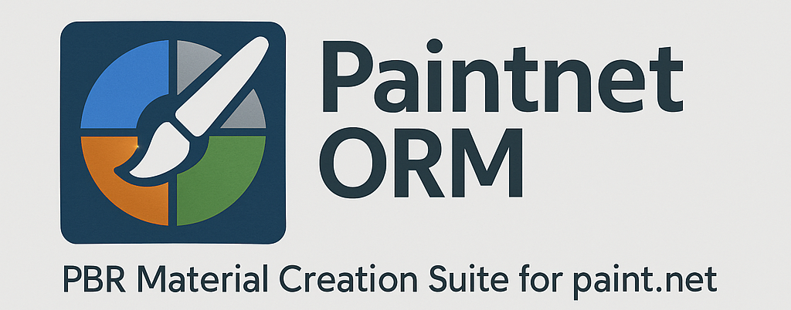

# PaintnetORM - PBR Material Creation Suite for Paint.NET

Eine umfassende Plugin-Suite für Paint.NET 5.x zur Erstellung von PBR (Physically Based Rendering) Materialien, insbesondere ORM (Occlusion, Roughness, Metallic) Maps und verwandten Texturen für Game Development und 3D-Modellierung.




## 📦 Enthaltene ORM-Plugins

### Terrain & Heightmap Tools

#### 🏔️ ORMTerrainGenerator - Terrain Heightmap Generator

**Version:** 1.0.0.0  
**Kategorie:** ORM → Terrain Heightmap Generator

Professioneller prozeduraler Terrain-Generator zur Erstellung realistischer Heightmaps mit Inseln, Bergen, Tälern, Flüssen und Seen.

**Features:**

- **Prozedurale Generierung:**
  - Multi-Oktaven Perlin Noise
  - Deterministische Seed-Kontrolle
  - Anpassbare Terrain-Komplexität
- **Terrain-Elemente:**
  - Inseln mit variierten Küstenlinien
  - Berg- und Tal-Systeme
  - Flüsse mit Gefälle-Verfolgung
  - Seen in natürlichen Senken
- **Erosions-Simulation:**
  - Nachbarschafts-basierte Glättung
  - Konfigurierbare Iterations-Stufen
  - Realistische Übergänge
- **Heightmap-Optimierung:**
  - Graustufen-Export (20-60 RGB)
  - Weiche Höhenstufen
  - Unreal Engine kompatibel

**Parameter:**

- Zufalls-Seed (0 = zufällig)
- Inselgröße (0.2 - 0.8)
- Berg-Intensität (0.0 - 1.0)
- Erosions-Iterationen (0 - 10)
- Fluss-Dichte (0.0 - 1.0)
- Rausch-Skalierung (1.0 - 10.0)
- Rausch-Oktaven (1 - 8)

**Verwendung:** `Effekte → ORM → Terrain Heightmap Generator`

---

#### 🏔️ ORMHeightmap - Heightmap Generator

**Version:** 1.0.0.0  
**Kategorie:** ORM → Emissive Map Generator

Erzeugt Emissive Maps (selbstleuchtende Bereiche) aus Bildern.

**Features:**

- Mehrere Erkennungsmodi:
  - Brightness (Helligkeit)
  - Saturation (Sättigung)
  - Brightness + Saturation
  - Manual Threshold
- Intensity-Steuerung
- Originalfarben beibehalten
- Saturation Boost
- Glow Radius für weiche Übergänge

**Verwendung:** `Effekte → ORM → Emissive Map Generator`

---

#### � ORMNormalmap - Normal Map Generator

**Version:** 1.0.0.0  
**Kategorie:** ORM → Heightmap Generator

Professioneller Heightmap-Generator mit umfangreichen Pinsel-Tools und Automatik-Funktionen.

**Features:**

- **Brush Tools:**
  - Raise, Lower, Flatten, Smooth
  - Noise, Terrace, Stamp
  - Erode, Dilate, Blur, Sharpen
- **Auto-Generation:**
  - Mountains, Hills, Valleys, Plains
  - Canyons, Plateaus, Coastal
  - Dunes, Volcanic, Arctic
- **Unreal Engine 4 Modus:**
  - Z-Scale Anpassung
  - 16-Bit Grayscale-Unterstützung
  - Min/Max Grayscale Clamping
- **Terrain-Kontrolle:**
  - Brush Size & Strength
  - Target Height & Max Terrain Height
  - Smoothness

**Verwendung:** `Effekte → ORM → Heightmap Generator`

---

### Material & Map Tools

#### 🗺️ ORMGenerator - ORM Map Generator

**Version:** 1.0.0.0  
**Kategorie:** ORM → ORM Map Generator

Generiert komplette ORM (Occlusion, Roughness, Metallic) Maps aus Bildern mit Material-Presets für verschiedene Oberflächen.

**Features:**

- **Material Presets:**
  - Metal, Plastic, Wood, Stone
  - Concrete, Glass, Fabric, Leather
  - Rubber, Ceramic, Paint
  - Custom-Einstellungen
- **Kanal-Kontrolle:**
  - Roughness aus verschiedenen Kanälen
  - Metallic aus verschiedenen Kanälen
  - Ambient Occlusion aus verschiedenen Kanälen
- **Auto-Erkennung:**
  - Automatische Material-Analyse
  - Intelligente Kanal-Zuweisung
- **Ausgabe-Modi:**
  - ORM Combined
  - Separate Channels
  - Preview Mode

**Verwendung:** `Effekte → Render → ORM Map Generator`

---

#### 🗺️ ORMEmissive - Emissive Map Generator

**Version:** 1.0.0.0  
**Kategorie:** ORM → Normal Map Generator

Konvertiert Heightmaps oder Graustufenbilder in Normal Maps für 3D-Rendering.

**Features:**

- Strength-Steuerung (0.1 - 20.0)
- Depth-Anpassung (0.1 - 5.0)
- Invert-Option für unterschiedliche Rendering-Engines
- Blur Radius für weichere Normal Maps
- Sobel-Filter basierte Berechnung

**Verwendung:** `Effekte → ORM → Normal Map Generator`

---

### Export & Vector Tools

#### 📐 ORMForm - XAML Shape Exporter

**Version:** 1.0.0.0  
**Kategorie:** ORM → ORM Form Exporter

Exportiert Zauberstab-Auswahlbereiche als Paint.NET SimpleGeometryShape XAML.

**Features:**

- Zauberstab Selection mit Toleranz-Steuerung (0-100%)
- Automatische Konturerkennung
- Douglas-Peucker Polygonvereinfachung
- Echzeit-Vorschau
- Export als Paint.NET SimpleGeometryShape Format

**Workflow:**

1. Öffne ein Bild in Paint.NET
2. Starte `Effekte → ORM → ORM Form Exporter`
3. Stelle Toleranz ein (Standard: 50%)
4. Klicke "Export XAML"
5. Speichere die .xaml Datei

**XAML Format:**

```xml
<ps:SimpleGeometryShape 
    xmlns="clr-namespace:PaintDotNet.UI.Media;assembly=PaintDotNet.Framework"
    xmlns:ps="clr-namespace:PaintDotNet.Shapes;assembly=PaintDotNet.Framework"
    DisplayName="Contour"
    Geometry="F1 M x,y L x,y ... Z" />
```

**Verwendung:** `Effekte → ORM → ORM Form Exporter`

---

#### 🖼️ ORMSVG - SVG Generator

**Version:** 1.0.0.0  
**Kategorie:** ORM → SVG Generator

Konvertiert hervorgehobene Bereiche von Bildern in SVG-Vektorgrafiken.

**Verwendung:** `Effekte → ORM → SVG Generator`

---

## 🚀 Installation

### Voraussetzungen

- Paint.NET 5.x oder höher
- .NET 9.0 Runtime
- Windows 10/11 (x64 oder ARM64)

### Automatische Installation aller ORM-Plugins

1. Schließe Paint.NET
2. Kopiere die DLL-Dateien nach `C:\Program Files\paint.net\Effects\`
3. Starte Paint.NET neu

### Manuelle Installation pro Plugin

```powershell
# ORMEmissive
Copy-Item "ORMEmissive\bin\Release\ORMEmissive.dll" "C:\Program Files\paint.net\Effects\"

# ORMHeightmap
Copy-Item "ORMHeightmap\bin\Release\ORMHeightmap.dll" "C:\Program Files\paint.net\Effects\"

# ORMNormalmap
Copy-Item "ORMNormalmap\bin\Release\ORMNormalmap.dll" "C:\Program Files\paint.net\Effects\"

# ORMForm
Copy-Item "ORMForm\bin\Release\ORMForm.dll" "C:\Program Files\paint.net\Effects\"

# ORMSVG
Copy-Item "ORMSVG\bin\Release\ORMSVG.dll" "C:\Program Files\paint.net\Effects\"
```

---

## 🛠️ Build-Anleitung

### Build-Voraussetzungen

- .NET 9.0 SDK
- Paint.NET 5.x Installation
- Visual Studio 2022 oder VS Code

### Build-Befehle

```powershell
# Gesamte Solution bauen
dotnet build PaintnetORM.sln

# Einzelnes Plugin bauen
cd ORMEmissive
dotnet build

# Release-Build
dotnet build -c Release
```

---

## 📖 Typische Workflows

### PBR Material Workflow

1. **Base Texture erstellen oder importieren**
2. **Heightmap generieren** (`ORMHeightmap`)
   - Nutze Auto-Generate für Terrain
   - Oder male manuell mit Brush Tools
3. **Normal Map erstellen** (`ORMNormalmap`)
   - Von Heightmap ableiten
   - Strength & Depth anpassen
4. **Emissive Map erstellen** (`ORMEmissive`)
   - Für leuchtende Bereiche
   - Mode wählen (Brightness/Saturation)
5. **Optional: Shape Export** (`ORMForm`)

### Vector Shape Workflow

1. **Bild in Paint.NET öffnen**
2. **ORMForm verwenden:**
   - ORM Form Exporter starten
   - Toleranz einstellen (0-100%)
   - Export XAML klicken
   - XAML-Datei speichern

---

## 🎨 Anwendungsbereiche

- **Game Development:** PBR-Texturen für Unreal Engine, Unity
- **3D Modeling:** Normal Maps, Height Maps für Blender, 3ds Max
- **Terrain Generation:** Heightmaps für Landschaften
- **Vector Graphics:** Shape-Export für WPF/XAML Anwendungen
- **Material Creation:** Komplette Material-Pipelines

---

## 🔧 Technische Details

- **Framework:** .NET 9.0-windows
- **Paint.NET API:** 5.x (modern effects system)
- **Algorithmen:**
  - Sobel-Filter (Normal Maps)
  - Flood Fill (Selections)
  - Moore-Neighbor Tracing (Contours)
  - Douglas-Peucker (Polygon Simplification)
- **Ausgabeformate:**
  - PNG, XAML (SimpleGeometryShape)

---

## 📝 Changelog

### Version 1.0.0.0 (Dezember 2025)

- ✅ Alle ORM-Plugins auf Paint.NET 5.x portiert
- ✅ ORMForm: XAML-Export für Shape-Daten
- ✅ ORMHeightmap: Umfangreiche Terrain-Tools
- ✅ ORMNormalmap: Normal Map Generation
- ✅ ORMEmissive: Emissive Map Generation
- ✅ .NET 9.0 Migration
- ✅ Modern effects API implementation

---

## 👤 Autor

ManfredAabye

- GitHub: [@ManfredAabye](https://github.com/ManfredAabye)
- Copyright © 2025

---

## 📄 Lizenz

Dieses Projekt steht unter der MIT-Lizenz.

---

## 🤝 Beiträge

Beiträge sind willkommen! Bitte erstelle Pull Requests oder Issues auf GitHub.

---

## ⚠️ Bekannte Einschränkungen

- Einige Brush-Modi in ORMHeightmap sind experimentell
- ORMSVG-Funktionalität ist noch in Entwicklung

---

## 📚 Weiterführende Links

- [Paint.NET Forum](https://forums.getpaint.net/)
- [Paint.NET Plugin Development](https://www.getpaint.net/doc/latest/index.html)
- [PBR Theory](https://learnopengl.com/PBR/Theory)
- [XAML Shapes Documentation](https://learn.microsoft.com/en-us/dotnet/desktop/wpf/graphics-multimedia/shapes)

---

## 🙏 Danksagungen

- Paint.NET Team für die großartige Software
- Community für Feedback und Testing

---

**Hinweis:** Dieses ist eine inoffizielle Plugin-Suite. Für Support bitte GitHub Issues nutzen.
